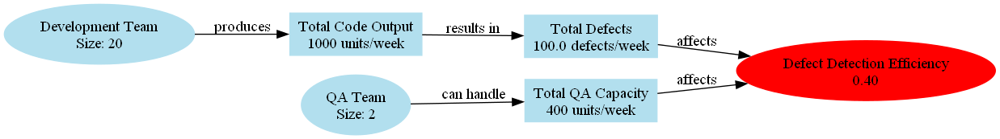
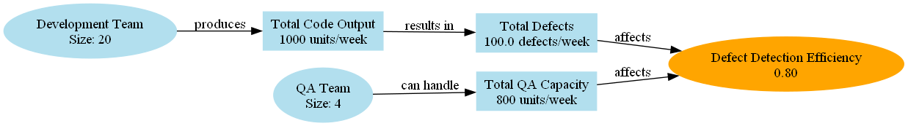
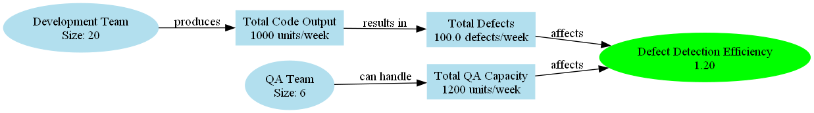

Certainly! Here is the updated README with the sample PNGs included:

---

# SDLC Efficiency Calculator

Welcome to the SDLC Efficiency Calculator, a simple yet powerful tool to demonstrate the critical importance of maintaining a balanced ratio of developers to QA engineers. This project aims to enlighten those who believe that throwing more development resources at a problem can magically ensure quality.

## Introduction

In the world of software development, it's easy to get caught up in the allure of rapidly expanding your development team to push features faster. However, without a properly scaled QA team, this approach often leads to an increase in production issues, unhappy customers, and ultimately, higher costs.

This calculator is designed to help visualize the impact of an imbalanced development and QA team, using simple metrics and a bit of humor.

## Features

- **Calculate Total Code Output**: Understand how much code your team is producing each week.
- **Estimate Total Defects**: See how many bugs are likely being introduced.
- **Assess QA Capacity**: Evaluate whether your QA team can keep up with the output.
- **Defect Detection Efficiency**: Visualize how well your QA team can catch defects before they hit production.
- **Graphical Visualization**: Generate a DOT file for visualizing the efficiency using Graphviz.

## Mathematical Notation

Given the following parameters:
- \( D \): Number of developers
- \( Q \): Number of QA engineers
- \( C \): Average code output per developer per week (units of code)
- \( R \): Defect rate (defects per unit of code)
- \( QC \): QA capacity per QA engineer per week (units of code)

The following calculations are performed:

1. **Total Code Output per Week**:
   \[
   \text{Total Code Output} = D \times C
   \]

2. **Total Defects per Week**:
   \[
   \text{Total Defects} = \text{Total Code Output} \times R
   \]

3. **Total QA Capacity per Week**:
   \[
   \text{Total QA Capacity} = Q \times QC
   \]

4. **Defect Detection Efficiency**:
   \[
   \text{Defect Detection Efficiency} = \frac{\text{Total QA Capacity}}{\text{Total Code Output}}
   \]

## Usage

Simply provide the number of developers, the number of QA engineers, and a few other basic metrics to get started. The calculator will do the rest, providing you with insightful results complete with emoji-based feedback and a visual representation.

### Example

Here's a quick example to show how you can use this tool:

```python
import os

class QAEfficiencyCalculator:
    def __init__(self, dev_count, qa_count, dev_output_per_week, defect_rate, qa_capacity_per_week):
        self.dev_count = dev_count
        self.qa_count = qa_count
        self.dev_output_per_week = dev_output_per_week
        self.defect_rate = defect_rate
        self.qa_capacity_per_week = qa_capacity_per_week

    def calculate(self):
        total_code_output = self.dev_count * self.dev_output_per_week
        total_defects = total_code_output * self.defect_rate
        total_qa_capacity = self.qa_count * self.qa_capacity_per_week
        defect_detection_efficiency = total_qa_capacity / total_code_output

        return {
            'total_code_output': total_code_output,
            'total_defects': total_defects,
            'total_qa_capacity': total_qa_capacity,
            'defect_detection_efficiency': defect_detection_efficiency
        }

    def generate_dot_file(self, results, filename="sdlc_efficiency.dot"):
        total_code_output = results['total_code_output']
        total_defects = results['total_defects']
        total_qa_capacity = results['total_qa_capacity']
        efficiency = results['defect_detection_efficiency']

        efficiency_color = "green" if efficiency >= 1 else "orange" if efficiency >= 0.5 else "red"

        dot_content = f"""
        digraph SDLC_Efficiency {{
            rankdir=LR;
            node [shape=box, style=filled, color=lightblue2];

            dev_team [label="Development Team\\nSize: {self.dev_count}", shape=ellipse];
            qa_team [label="QA Team\\nSize: {self.qa_count}", shape=ellipse];
            dev_output [label="Total Code Output\\n{total_code_output} units/week"];
            defects [label="Total Defects\\n{total_defects} defects/week"];
            qa_capacity [label="Total QA Capacity\\n{total_qa_capacity} units/week"];
            efficiency [label="Defect Detection Efficiency\\n{efficiency:.2f}", shape=ellipse, color={efficiency_color}];

            dev_team -> dev_output [label="produces"];
            dev_output -> defects [label="results in"];
            qa_team -> qa_capacity [label="can handle"];
            qa_capacity -> efficiency [label="affects"];
            defects -> efficiency [label="affects"];
        }}
        """

        with open(filename, "w") as file:
            file.write(dot_content)
        print(f"DOT file generated: {filename}")

if __name__ == "__main__":
    dev_count = 20
    qa_count = 2
    dev_output_per_week = 50  # units of code
    defect_rate = 0.1  # defects per unit of code
    qa_capacity_per_week = 200  # units of code

    calculator = QAEfficiencyCalculator(dev_count, qa_count, dev_output_per_week, defect_rate, qa_capacity_per_week)
    results = calculator.calculate()
    calculator.generate_dot_file(results)

    # Generate visualization using Graphviz (requires Graphviz installed)
    os.system("dot -Tpng sdlc_efficiency.dot -o sdlc_efficiency.png")
    print("Visualization generated: sdlc_efficiency.png")
```

## Output

You will see something like this in your console or output file:

```
📊 Development Team Size: 20
🔍 QA Team Size: 2
👨‍💻 Average Code Output per Developer: 50
🐞 Defect Rate: 0.1
🛠️ QA Capacity per QA Engineer: 200

--- Results ---
📈 Total Code Output per Week: 1000
🔧 Total Defects per Week: 100
🧪 Total QA Capacity per Week: 400
📉 Defect Detection Efficiency: 0.40 😟
```

## Visual Representation

A DOT file (`sdlc_efficiency.dot`) is generated for visualization. You can convert this file into a PNG image using Graphviz:

```sh
dot -Tpng sdlc_efficiency.dot -o sdlc_efficiency.png
```

This command will generate a PNG image (`sdlc_efficiency.png`) of the graph.

### Sample Visualizations





## Important Notes

- **Console Compatibility**: If your console does not support Unicode characters, the results will be written to a file named `output.txt` in UTF-8 encoding.
- **Understanding the Results**: The emojis give a quick visual cue:
  - 😃 High efficiency: Your QA team is well-equipped to handle the load.
  - 😐 Moderate efficiency: Your QA team is coping but might miss some defects.
  - 😟 Low efficiency: Your QA team is overwhelmed, and many defects are likely slipping through.

## TODO

- **Automate Data Collection**: Integrate with GitHub API to fetch current or rolling metrics for development and QA activities.
  - **Total Code Output**: Calculate based on recent commits and lines of code changes.
  - **Defect Rate**: Derive from the number of issues/bugs reported in the repository.
  - **QA Capacity**: Adjust based on actual QA throughput data from the team's issue tracking system.

## Conclusion

In conclusion, while increasing the number of developers can accelerate feature delivery, it's crucial to invest proportionately in your QA team to maintain software quality. Use this calculator to balance your resources and achieve engineering excellence!

---

Remember, the key to a successful software development lifecycle (SDLC) is not just more code but better code. Let's ensure our QA teams are not left behind in the race for rapid development.

---